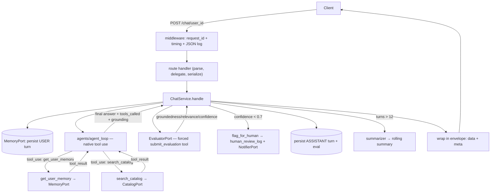

# AI Sales Assistant API

Welcome! This is a smart AI agent designed for sales teams. Think of it as a highly trained sales representative that lives in the cloud, ready to chat with your customers 24/7.

Unlike simple chatbots that forget what you said as soon as you close the page or refresh your browser, this agent **remembers your past conversations**. It uses a real database to store chat histories, so if a customer asks a question on Monday and follows up on Friday, the AI will remember exactly what they were talking about!

- **Live Demo URL:** `https://sales-agent-production-c77f.up.railway.app`
- **What it does:** Answers questions about pricing and product features based on your company's official catalog.

---

## 🌟 What can you do with this? (Use Cases)

Because this is an "API" (a brain hosted in the cloud), you can plug it into almost any app or service your business already uses! Here are a few ways to use it:

### 1. Website Chat Widget
Add a small chat bubble to the corner of your website. When visitors ask about pricing, the AI answers instantly. Because it remembers users, it can hold a natural, ongoing conversation with them as they browse your site.

### 2. Automated SMS / WhatsApp Bot
Connect this API to Twilio to create an SMS or WhatsApp bot. Customers can text your business number, and the AI will reply to them like a real human. It uses their phone number to remember who they are!

### 3. Internal Slack / Discord Assistant
Add the bot to your company's Slack. Your new sales hires can tag the bot to ask questions like "Does the Pro plan include audit logs?" and get immediate, accurate answers based on the official company catalog.

### 4. CRM Integration (Zendesk / HubSpot)
Hook the AI into your support inbox. When a customer emails a question about upgrading their plan, the AI can read the email, understand the context from past interactions, and draft a perfect reply for a human agent to review and send.

---

## 🚀 Try It Yourself! (Live Demo)

You can test the agent's cross-session memory right now using the live API. These two terminal commands prove the agent remembers context across entirely different sessions without relying on the request body.

> **🔐 You need an API key.** The `/chat` and `/reviews` endpoints are protected — every
> request must send an `X-API-Key` header. `/health` and `/catalog` stay open. Ask the
> maintainer for a key, then substitute it below.

### Method 1: The Interactive Web UI (Easiest!)
1. Go to **[https://sales-agent-production-c77f.up.railway.app/docs](https://sales-agent-production-c77f.up.railway.app/docs)** in your browser.
2. Click the **"Authorize"** button (top right), paste your API key, and confirm.
3. Click the green `POST /chat/{user_id}` button to expand it.
4. Click the **"Try it out"** button on the right.
5. Put your name in the `user_id` box.
6. In the Request Body, enter `{"message": "What is the Enterprise plan?"}` and click the big blue **Execute** button.
7. Scroll down to see the response. Then, change the message to `{"message": "How much does it cost?"}` and click **Execute** again. Notice how it remembers you are talking about the Enterprise plan!

### Method 2: Command Line (For Developers)

If you prefer the terminal, you can prove the agent's memory works across separate requests using `curl`. First put your key in a variable so it's not repeated:

```bash
export API_KEY="paste-your-key-here"
```

**Step 1: Session A — Establish Context**
```bash
curl -s -X POST "https://sales-agent-production-c77f.up.railway.app/chat/acme-corp" \
  -H "X-API-Key: $API_KEY" \
  -H 'Content-Type: application/json' \
  -d '{"message":"What does your Enterprise plan cost?"}' | jq
```

**Step 2: A NEW Session — Relying entirely on remembered context**
*Notice we do not mention the word "Enterprise" here!*
```bash
curl -s -X POST "https://sales-agent-production-c77f.up.railway.app/chat/acme-corp" \
  -H "X-API-Key: $API_KEY" \
  -H 'Content-Type: application/json' \
  -d '{"message":"Does that plan include SSO?"}' | jq
```
*The AI will answer "yes" because it remembers the context of the conversation for the user `acme-corp`.*

---

## 🧠 Architecture & Technical Deep Dive

For developers and reviewers, here is how the agent works under the hood.

1. **Real Tool Use:** The AI doesn't just guess or hallucinate answers. When you ask a question, it uses a digital tool to search an official product catalog. If the answer isn't in the catalog, it won't make one up.
2. **Persistent Memory:** Chat histories are saved in a powerful PostgreSQL database in the cloud. We don't rely on the browser to remember things.
3. **Quality Control (Self-Evaluation):** Before the AI sends an answer back to the user, a separate internal AI reads the answer and grades it. If the answer seems wrong, confusing, or low-quality, the system automatically flags it for a human to review later!
4. **Access Control:** The data and chat endpoints sit behind an API key, requests are rate-limited per caller, and message size is bounded — so a stranger can't read another user's history, drain the LLM budget, or flood the service.

### Architecture Request Flow



### Memory Design — And what we'd use at scale

**Decision: hybrid.** Raw turns are the source of truth (the `/history` endpoint needs them anyway), and once a user passes ~12 turns the older ones (everything beyond the most recent ~6) are folded into a **rolling summary** by a cheap Claude call. `get_user_memory` returns *summary + recent turns* — that is the operational meaning of "relevant past facts." Memory keys on `user_id`, so it spans sessions.

*Why not embeddings?* The catalog is three plans and per-user history is small; a vector store would be unjustified dependency weight. Retrieval is recency + the rolling summary, behind the `MemoryPort` seam.

*At scale:* We would swap `SqlMemoryStore` for a dedicated memory service (like Mem0 or Zep) with semantic retrieval, per-fact storage with dedup/decay, and a vector index. Because the app uses hexagonal architecture, this requires writing exactly one adapter with zero caller changes. Postgres already runs in production via the same port, which is the cheapest possible proof the abstraction holds.

### Eval Design — Limitations and replacement

The eval block is **earned, not random**. A dedicated `EvaluatorPort` makes a second, cheap Claude call (Haiku) that scores the draft against the grounding the tools returned, via a **forced `submit_evaluation` tool** — so the output is structured and Pydantic-validated, never free-text-parsed. The **threshold is authoritative**: the server sets `flagged = confidence < 0.7` regardless of what the model says; if the evaluator fails to return structured output it **fails safe to flagged**. Every eval is persisted, so `/evals` is a real query.

*Honest limitations:* A model grading its own (same-family) output shares its blind spots (correlated error), has no ground truth, and is gameable. 
*At scale:* I'd replace self-eval with an independent judge model (e.g. GPT-4o judging Claude), a golden/regression dataset with human-labeled spot checks, and calibration of the confidence threshold against measured accuracy — keeping the per-response score only as a fast first-pass gate.

---

## 💻 Local Development

```bash
# 1. Install dependencies
uv sync                              

# 2. Create your .env and add your Anthropic API key.
#    Locally you can leave API_KEY blank — auth is disabled when it's unset.
cp .env.example .env                 

# 3. Setup the local SQLite database
uv run alembic upgrade head          

# 4. Start the server
uv run uvicorn app.main:app --reload 
# The app will be running at http://127.0.0.1:8000
```

### Deploying to production
Set these environment variables on your host (e.g. Railway):

| Variable | Why |
|---|---|
| `ENVIRONMENT=production` | Turns the unsafe local defaults into hard boot-time errors. |
| `API_KEY=<a long random secret>` | Required in production — gates `/chat` and `/reviews`. |
| `DATABASE_URL=postgresql://…` | Required in production — Railway's Postgres plugin injects this. SQLite is ephemeral and would lose all memory on redeploy. |
| `ANTHROPIC_API_KEY=<your key>` | So the agent can reach Claude. |
| `CORS_ALLOW_ORIGINS=` | Optional. Comma-separated browser origins (e.g. a chat-widget host). Leave empty for server-to-server only. |

With `ENVIRONMENT=production` set, the app **refuses to boot** if `API_KEY` is missing or `DATABASE_URL` still points at SQLite — so an insecure config fails loudly instead of silently.

> **Scaling note:** migrations run on boot (`start.sh`), which assumes a **single instance**. Before scaling past one replica, move `alembic upgrade head` to a one-off release step so concurrent boots don't race on it.
